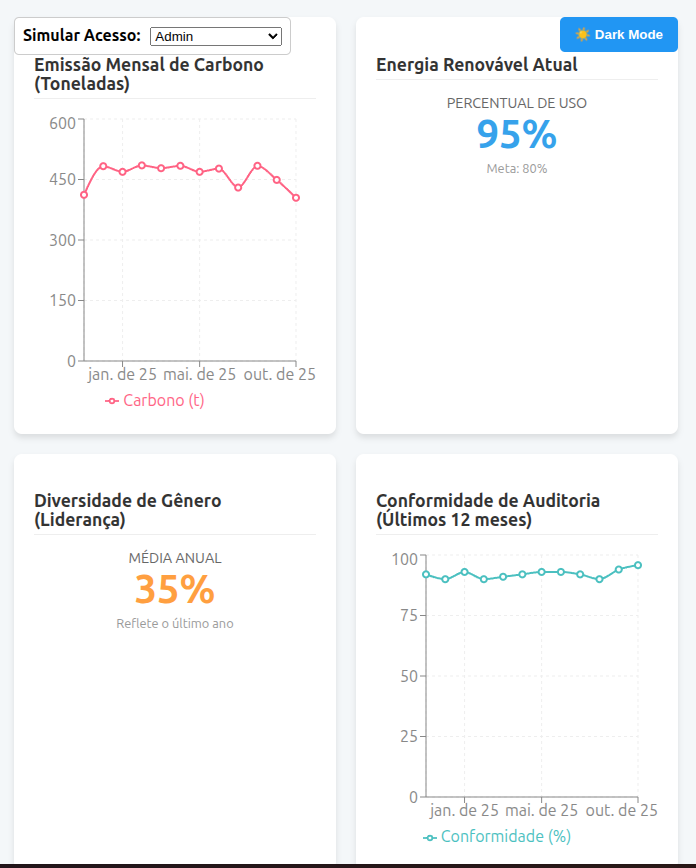

# 📊 Sustainable ESG Dashboard (React)


Este projeto é um **Dashboard de Análise de Dados Interativo e Responsivo** construído com React. O projeto demonstra a criação de uma interface analítica robusta, com foco na visualização de métricas de **Sustentabilidade Corporativa (ESG - Ambiental, Social e Governança)** e na aplicação de arquitetura moderna de front-end.

Foi desenvolvido como um projeto principal de portfólio para evidenciar habilidades avançadas em componentização, gerenciamento de estado e design responsivo (CSS Grid).

## ✨ Principais Funcionalidades e Destaques Técnicos

| Funcionalidade | Implementação Técnica | Habilidades Demonstradas |
| :--- | :--- | :--- |
| **Simulação de Permissões (RBAC)** | **React Context API** (`useAuth`) e Renderização Condicional. | Lógica de Negócios e Controle de Acesso no Front-end. |
| **Atualização em Tempo Real** | **Hook Personalizado** (`useRealTimeData`) com `setInterval`. | Simulação de Polling/Stream de API e Gerenciamento de Efeitos Colaterais. |
| **Layout Adaptável** | **CSS Grid Avançado** (`grid-template-columns`) e **Media Queries**. | Proficiência em design responsivo puro, otimizando o layout para Mobile/Tablet. |
| **Dark Mode Profissional** | **React Context API** (`useTheme`) e classes CSS dinâmicas. | Gerenciamento de Estado Global, Melhoria de UX/Acessibilidade. |
| **Visualização de Dados** | Biblioteca **Recharts** (Gráficos de Linha e KPIs). | Integração e customização de bibliotecas de visualização de dados. |

---

## 🛠️ Tecnologias e Dependências

* **Front-end Framework:** `ReactJS`
* **Visualização:** `recharts`
* **Estilização:** CSS3 Puro (Flexbox/Grid Avançado)
* **Hooks Customizados:** `useAuth`, `useTheme`, `useRealTimeData`

---

## 🏗️ Estrutura do Código

A arquitetura segue o princípio de separação de responsabilidades (SoC):

sustainable-dashboard/ ├── src/ │ ├── components/ # Componentes Reutilizáveis (UI) │ │ ├── charts/ # -> Gráficos │ │ ├── DashboardCard.js # -> Wrapper de Layout │ │ └── KpiCard.js # -> Componente de KPI │ ├── data/ │ │ └── mockData.js # Simulação de Dados Iniciais │ ├── hooks/ # Lógica de Estado e APIs Customizadas │ │ ├── useAuth.js # -> Permissões │ │ ├── useRealTimeData.js # -> Dados em Tempo Real │ │ └── useTheme.js # -> Dark Mode │ ├── styles/ │ │ └── DashboardLayout.css # Definição do Grid Responsivo │ └── App.js # Orquestrador Principal

---

## 🚶 Passo a Passo Técnico

Esta seção detalha as soluções arquiteturais implementadas para cada requisito do projeto.

### 1. Layout Grid Responsivo

O container principal utiliza o módulo CSS Grid para dispor os widgets. A responsividade é garantida por *Media Queries*, que ajustam o número de colunas:

| Tela | `grid-template-columns` | Resultado |
| :--- | :--- | :--- |
| Desktop (>1024px) | `repeat(3, 1fr)` | 3 Colunas |
| Tablet (601px-1024px) | `repeat(2, 1fr)` | 2 Colunas |
| Mobile (<600px) | `1fr` | 1 Coluna |

### 2. Gerenciamento de Permissões (Context API)

A lógica de Autenticação e Autorização (RBAC simples) é gerenciada via `AuthContext`. O hook `useAuth` fornece o nível de permissão (e.g., `canSeeEnvironmental`), que é usado para renderização condicional em `App.js`.

**Tabela de Permissões (Simulada):**

| Perfil                | Acesso E (Ambiental) | Acesso G (Governança) |
| **Admin**             | ✅                   | ✅                    |
| **Leitor ESG**        | ✅                   | ❌                    |
| **Leitor Governança** | ❌                   | ✅                    |
| **Usuário Comum**     | ❌                   | ❌                    |

### 3. Simulação de Dados em Tempo Real (`useRealTimeData`)

Para simular o *streaming* de dados sem a necessidade de um back-end real, foi criado o `useRealTimeData`.

O hook utiliza:
1.  `useState` para armazenar o estado atual dos dados.
2.  `useEffect` para iniciar um `setInterval`.
3.  A função `fluctuateData` para modificar aleatoriamente o último ponto de dados a cada **5 segundos**.
4.  O **Cleanup Function** (`return () => clearInterval(intervalId)`) para evitar vazamento de memória.

```javascript
// src/hooks/useRealTimeData.js
useEffect(() => {
    const intervalId = setInterval(() => {
        // ... (Lógica de atualização dos dados)
    }, 5000); // Atualiza a cada 5 segundos

    return () => clearInterval(intervalId); // Cleanup vital!
}, [updateInterval]);

4. Dark Mode (Context API)
O tema escuro é habilitado globalmente, com persistência via localStorage. A aplicação usa a propriedade isDarkMode do hook useTheme para alternar classes CSS (dark-mode) no container principal e ajustar cores em componentes específicos (ex: linha do gráfico).

🖼️ Demonstração Visual do Dark Mode


⚙️ Como Rodar o Projeto Localmente
Requisitos:

Node.js (v14+)

npm (ou yarn)

Clone o repositório:

Bash:

git clone https://github.com/lrb7dev/MAIN_PROJECTS.git
cd sustainable-dashboard
Instale as dependências:

Bash:

npm install 
# ou yarn install

Inicie o servidor de desenvolvimento:

Bash:

npm start
# ou yarn start

O Dashboard será aberto automaticamente no seu navegador em http://localhost:3000.

📝 Licença
Este projeto está sob a licença MIT.

👤 Autor

Luan Rabelo

GitHub: https://github.com/lrb7dev

LinkedIn: https://www.linkedin.com/in/luan-rabelo-batista-a80734251/